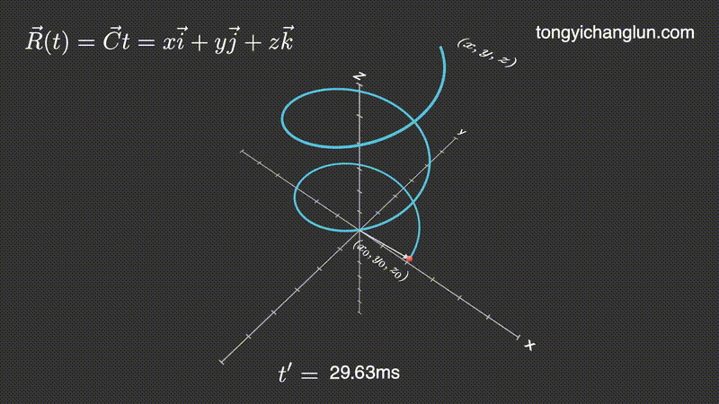
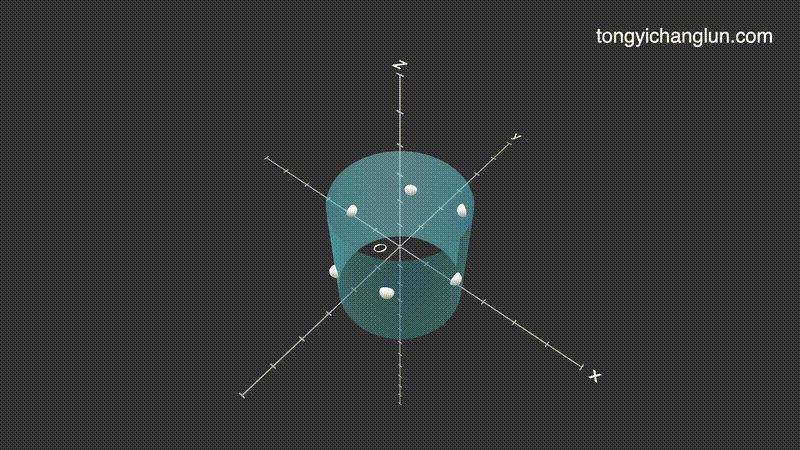
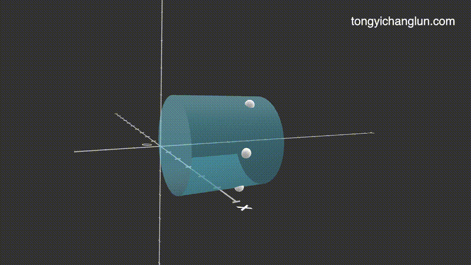
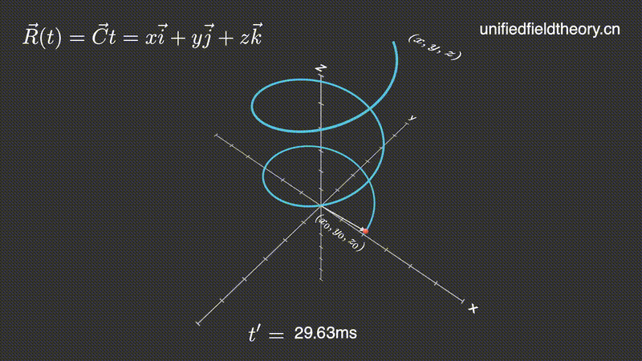
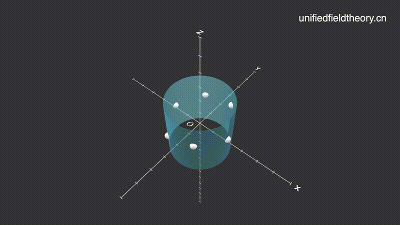
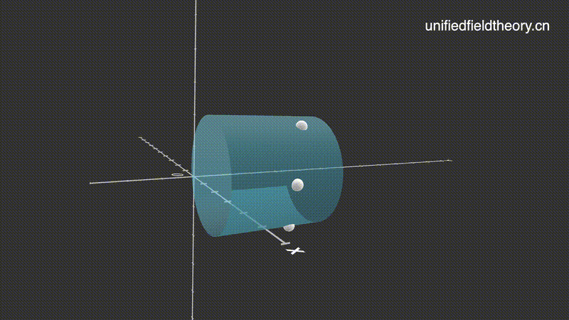

# Generated Animations

These are the animations that have been generated.

## Chinese

1. 时空同一化方程
	

2. 统一场论
	

3. 电场
	

4. 磁场
	

5. 引力场
	

## English

1. Space time Isomorphism equation
	

2. Unified field theory
	

3. Electric field
	
	
4. Magnetic field
	

5. Gravitational field
	